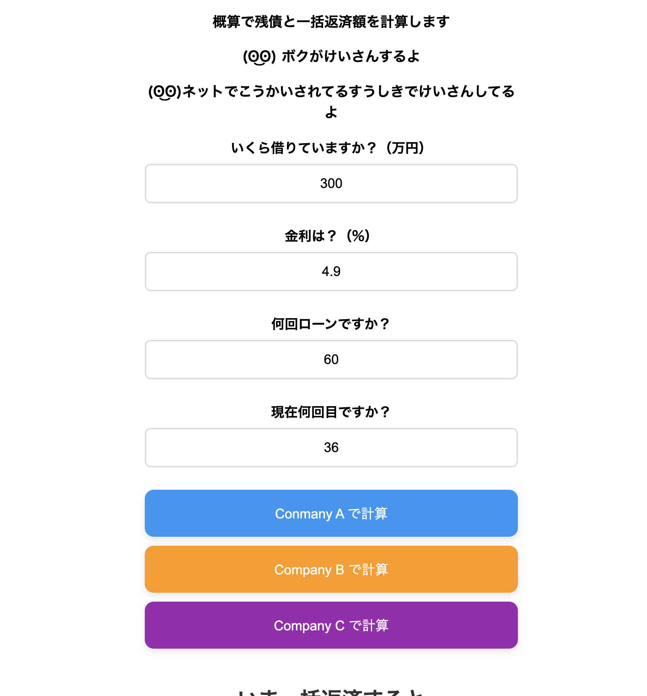

# loan-simulator
Loan calculator built with PHP

## Screenshots

### Input

## Overview
中古車販売店で働く友人から、「自動車ローンの一括返済額はローン会社へ問い合わせないと分からず、
お客様へ概算をすぐ案内できるツールが欲しい」という相談を受け、このシミュレーターを開発しました。

当初はGoogleスプレッドシートで運用していましたが、
より使いやすくするためPHPによるWebアプリケーションとして作り直しました。

主な機能
・ローン残高の概算計算
・一括返済額の概算表示

計算方法
本シミュレーターでは、ローンの計算にPMT関数の考え方を用いて返済額を算出しています。
一括返済額は各ローン会社によって計算方法や手数料が異なるため、
公開されている情報を参考に概算値を算出しています。

概算額は以下の処理を行っています。

・PMT方式による返済額を基に残高を計算
・実際の返済額との差を考慮し、クレーム防止のため概算残高に1%を加算
・ローン会社ごとの一括返済手数料を加算
・1万円未満を切り捨てて表示

※ 実際の一括返済額は契約先のローン会社へお問い合わせください。

## Screenshots

### Result

## Technologies
使用技術
・PHP
・HTML
・CSS

## Features
開発の目的
実際の業務で利用できるツールを目指し、現場での使いやすさを重視して開発しました。
今後は、返済予定表やグラフ表示などの機能追加も予定しています。

